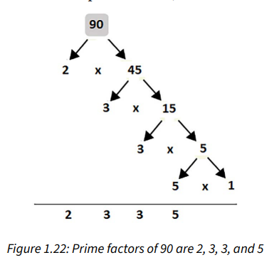

A prime number is a number divisible by itself and 1 (for instance, 2, 3, and 5 are prime numbers).
Having a given number, we can extract its prime factors, as in the following figure:
Figure 1.22: Prime factors of 90 are 2, 3, 3, and 5
The prime factors of 90 are 2, 3, 3, and 5.
